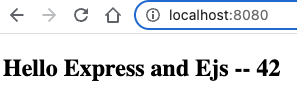

# jscomplete

A step-to-step guide for setting up a pure React.js application by focusing on React itself.

## Dependencies

[Node.js](https://nodejs.org/en/) > 0.8

[React.js](https://reactjs.org/) > 15.0

[Yarn](https://yarnpkg.com/): package manager for Javascript

[Babel](https://babeljs.io/)/[Webpack](https://webpack.js.org/): to configure a full-stack Javascript environment from scratch without using any templates or generators

[Express](https://expressjs.com/):server-side rendering of assets and to host the API

[PM2](https://pm2.keymetrics.io/): process manager to run the node process both in development and production

[Jest](https://jestjs.io/): Javascript testing framework

[ESlint](https://eslint.org/)

## Setup

### Folder hierarchy

`$ mkdir advanced-react`

`$ cd advanced-react`

`$ mkdir lib`

`$ mkdir public`

`$ touch lib/server.js`

### Yarn

`$ yarn init`
```
# ===> yarn init v1.22.10
warning ../package.json: No license field
question name (advanced-react):
question version (1.0.0):
question description: Advanced React
question entry point (index.js): lib/server.js
question repository url: jscomplete/advanced-react
question author: Rafia Qutab
question license (MIT):
question private: no
success Saved package.json
✨  Done in 42.88s.
````

### ESLint

ESLint is valuable to detect failures on save vs. discovering later in server logs or browser console. It will save you a lot of time.

`$ yarn config set ignore-engines true`

`$ yarn add --dev eslint`

You can setup eslint via: `yarn eslint -- --init` however we need a style guide that understands a modern javascript syntax such as class properties which is why we will use the recommended settings with the Babel `eslint` parser + additional customization.

`$ touch .eslintrc.js` # copy/paste from `.eslintrc.js` found in this repo.

`$ yarn add --dev eslint-plugin-react babel-eslint`

### Express

Minimalist web framework for Node.js.

Start Express server web application by installing express and ejs, the two production dependencies:

`$ yarn add express ejs` # ejs for minimal templating on server side

You will need to configure Express to use ejs as its template language in the `server.js` file.

### PM2

PM2 is a daemon process manager that will allow us to render a cluster rather than a single node in production.

`$ yarn add pm2`

Add pm2 script to package.json with `--watch` and start the server in the background:

`$ yarn dev`

To detect the logs:

`$ yarn pm2 logs`

You can test by changing the server.js code.

### Babel

To help the server side render the react application i.e interpret the jsx syntax.

With Babel we can use the `import` syntax instead of `const`. Babel helps node to understand the `import` syntax.

Babel will be used as a production dependency instead of development dependency.

`yarn add @babel/core`

Install babel cli and presets.

`yarn add @babel/cl @babel/preset-react @babel/preset-env @babel/preset-stage-2`

`stage-2` allows you to use features such as class properties which are on their way to become part of the language.

Now let pm2 know to use babel node as the interpreter:

`yarn add @babel/node`

and add the `--interpreter babel-node` flag to the dev command. Next, restart the pm2 process via `$ yarn dev`

Accessing localhost:8080 should now show:



---

### React and Webpack

To run a React application on the client-side

`$ yarn add react react-dom webpack`

To tell webpack where to start and place the bundle.js, we will create webpack.config.js file and use a [configuration](https://webpack.js.org/concepts/#loaders) template found on webpack documentation site and modify the `entry`, `path`, and `filename`.

Use `babel-loader` as a dependency.

`$ yarn add babel-loader`

Add `webpack` script to package.json with `-w` flag to watch the files and `-d source-map --mode development` to make it easier to debug the code.

Run the webpack command:

`$ yarn webpack`

#### Optimization

To see how long it took to generate the bundle:

`$ time yarn webpack`

Note: remove the `--watch` or `-w` flag to display the execution time.

Make sure to exclude node_modules in the webpack configuration. We do not need babel to run on node_modules, just on our application code.
